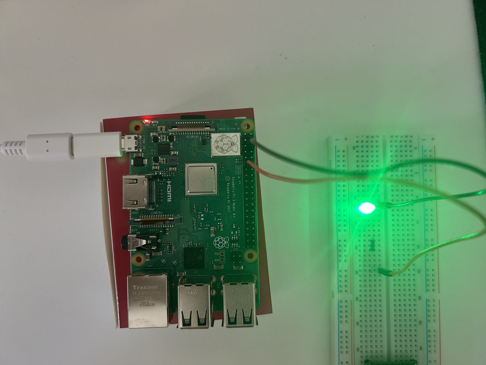

# 01 - GPIO Blink

Primer programa en C controlando un LED desde Linux embebido usando libgpiod v2.

## Concepto
Control de GPIO desde userspace en Linux sin abstracciones de Arduino.
El pin GPIO17 se controla abriendo /dev/gpiochip0 como archivo de dispositivo.

## Hardware
- Raspberry Pi 3B+
- LED en GPIO17 (pin físico 11)
- Resistencia 220R en serie
- GND en pin físico 6

## Circuito

## Compilar y ejecutar
make
./blink
