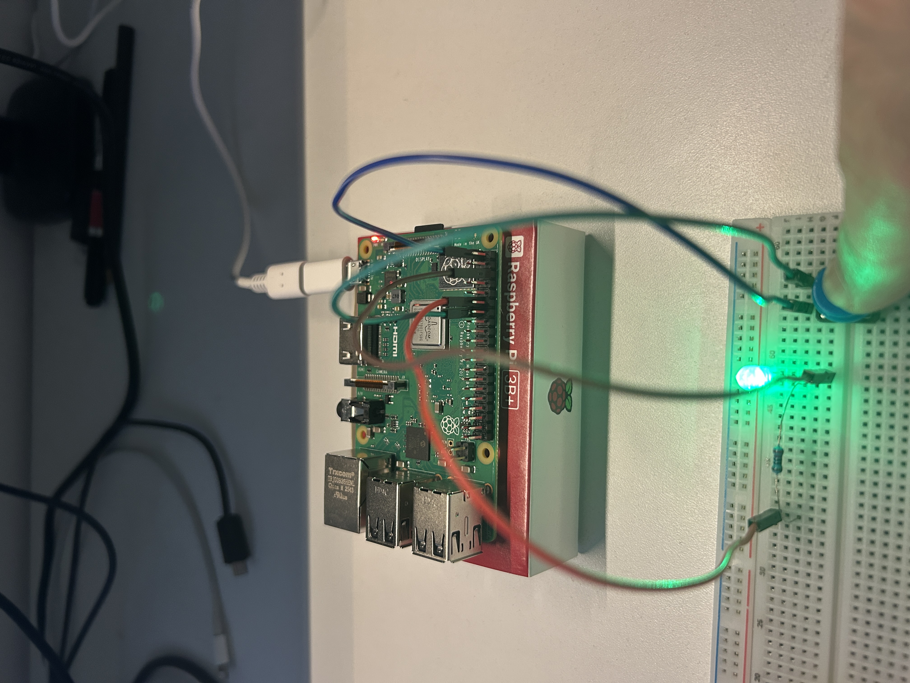

# 02 - Pulsador con LED

Lectura de entrada digital con pull-down interno y control de LED. Incluye debouncing por software.

## Concepto
El GPIO27 se configura como entrada con resistencia pull-down interna activada por software.
El estado del pulsador se lee en un loop y se refleja directamente en el LED (GPIO17).
El debouncing evita lecturas falsas por rebote mecánico del contacto.

## Hardware
- Raspberry Pi 3B+
- LED en GPIO17 (pin físico 11) con resistencia 220Ω
- Pulsador entre 3.3V (pin 1) y GPIO27 (pin físico 13)

## Compilar y ejecutar
make
./pulsador

## Circuito

